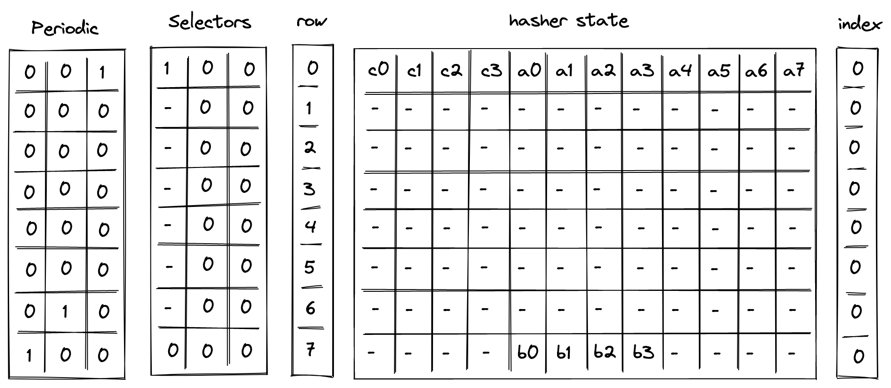
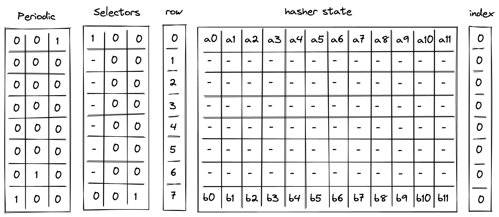
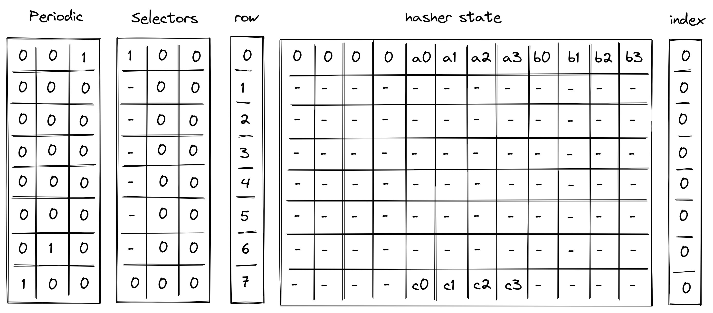
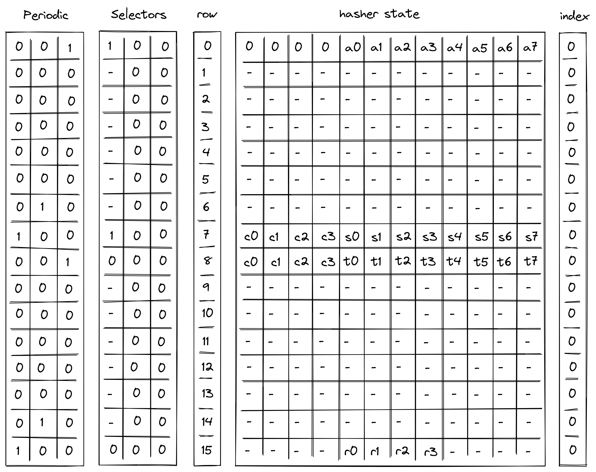
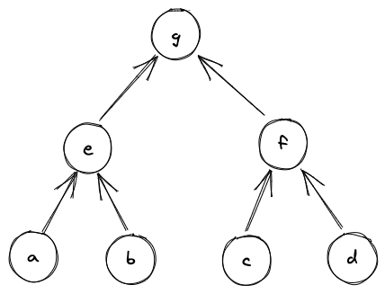
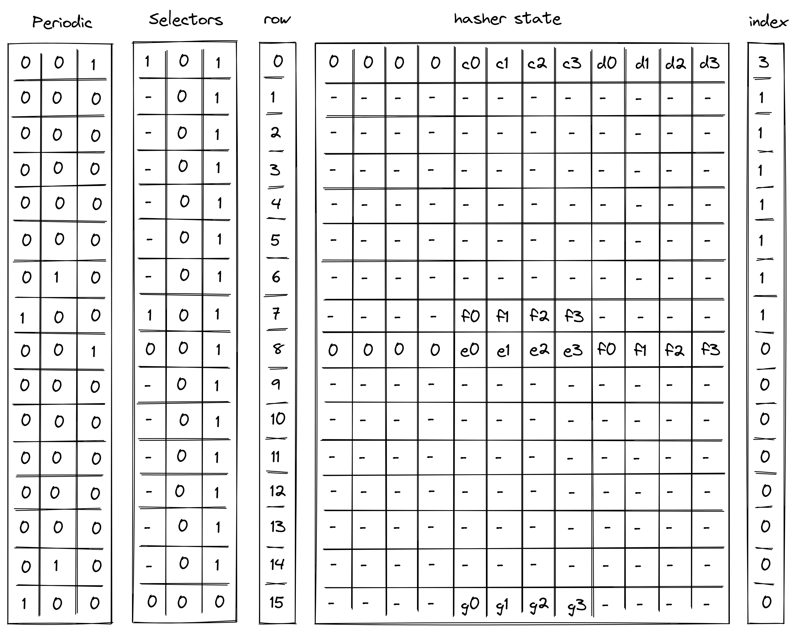

Miden VM "offloads" all hash-related computations to a separate _hash processor_. This chiplet supports executing the [Rescue Prime Optimized](https://eprint.iacr.org/2022/1577) hash function (or rather a [specific instantiation](https://docs.rs/miden-crypto/latest/miden_crypto/hash/rpo/struct.Rpo256.html) of it) in the following settings:

- A single permutation of Rescue Prime Optimized.
- A simple 2-to-1 hash.
- A linear hash of $n$ field elements.
- Merkle path verification.
- Merkle root update.

The chiplet can be thought of as having a small instruction set of $11$ instructions. These instructions are listed below, and examples of how these instructions are used by the chiplet are described in the following sections.

| Instruction | Description |
| ----------- | ----------- |
| `HR`       | Executes a single round of the VM's native hash function. All cycles which are not one less than a multiple of $8$ execute this instruction. That is, the chiplet executes this instruction on cycles $0, 1, 2, 3, 4, 5, 6$, but not $7$, and then again, $8, 9, 10, 11, 12, 13, 14$, but not $15$ etc.                             |
| `BP`        | Initiates computation of a single permutation, a 2-to-1 hash, or a linear hash of many elements. This instruction can be executed only on cycles which are multiples of $8$, and it can also be executed concurrently with an `HR` instruction.                                                                      |
| `MP`        | Initiates Merkle path verification computation. This instruction can be executed only on cycles which are multiples of $8$, and it can also be executed concurrently with an `HR` instruction.                                                                                                                       |
| `MV`        | Initiates Merkle path verification for the "old" node value during Merkle root update computation. This instruction can be executed only on cycles which are multiples of $8$, and it can also be executed concurrently with an `HR` instruction.                                                                    |
| `MU`        | Initiates Merkle path verification for the "new" node value during Merkle root update computation. This instruction can be executed only on cycles which are multiples of $8$, and it can also be executed concurrently with an `HR` instruction.                                                                    |
| `HOUT`      | Returns the result of the currently running computation. This instruction can be executed only on cycles which are one less than a multiple of $8$ (e.g. $7$, $15$ etc.).                                                                                                                                          |
| `SOUT`      | Returns the whole hasher state. This instruction can be executed only on cycles which are one less than a multiple of $8$, and only if the computation was started using `BP` instruction.                                                                                                                         |
| `ABP`       | Absorbs a new set of elements into the hasher state when computing a linear hash of many elements. This instruction can be executed only on cycles which are one less than a multiple of $8$, and only if the computation was started using `BP` instruction.                                                      |
| `MPA`       | Absorbs the next Merkle path node into the hasher state during Merkle path verification computation. This instruction can be executed only on cycles which are one less than a multiple of $8$, and only if the computation was started using `MP` instruction.                                                    |
| `MVA`       | Absorbs the next Merkle path node into the hasher state during Merkle path verification for the "old" node value during Merkle root update computation. This instruction can be executed only on cycles which are one less than a multiple of $8$, and only if the computation was started using `MV` instruction. |
| `MUA`       | Absorbs the next Merkle path node into the hasher state during Merkle path verification for the "new" node value during Merkle root update computation. This instruction can be executed only on cycles which are one less than a multiple of $8$, and only if the computation was started using `Mu` instruction. |

## Chiplet trace

Execution trace table of the chiplet consists of $17$ trace columns and $3$ periodic columns. The structure of the table is such that a single permutation of the hash function can be computed using $8$ table rows. The layout of the table is illustrated below.



The meaning of the columns is as follows:

- Three periodic columns $k_0$, $k_1$, and $k_2$ are used to help select the instruction executed at a given row. All of these columns contain patterns which repeat every $8$ rows. For $k_0$ the pattern is $7$ zeros followed by $1$ one, helping us identify the last row in the cycle. For $k_1$ the pattern is $6$ zeros, $1$ one, and $1$ zero, which can be used to identify the second-to-last row in a cycle. For $k_2$ the pattern is $1$ one followed by $7$ zeros, which can identify the first row in the cycle.
- Three selector columns $s_0$, $s_1$, and $s_2$. These columns can contain only binary values (ones or zeros), and they are also used to help select the instruction to execute at a given row.
- One row address column $r$. This column starts out at $1$ and gets incremented by $1$ with every row.
- Twelve hasher state columns $h_0, ..., h_{11}$. These columns are used to hold the hasher state for each round of the hash function permutation. The state is laid out as follows:
  - The first four columns ($h_0, ..., h_3$) are reserved for capacity elements of the state. When the state is initialized for hash computations, $h_0$ should be set to $0$ if the number of elements to be hashed is a multiple of the rate width ($8$). Otherwise, $h_0$ should be set to $1$. $h_1$ should be set to the domain value if a domain has been provided (as in the case of [control block hashing](../programs.md#program-hash-computation)).  All other capacity elements should be set to $0$'s.
  - The next eight columns ($h_4, ..., h_{11}$) are reserved for the rate elements of the state. These are used to absorb the values to be hashed. Once the permutation is complete, hash output is located in the first four rate columns ($h_4, ..., h_7$).
- One index column $i$. This column is used to help with Merkle path verification and Merkle root update computations.

In addition to the columns described above, the chiplet relies on two running product columns which are used to facilitate multiset checks (similar to the ones described [here](https://hackmd.io/@arielg/ByFgSDA7D)). These columns are:

- $p_0$ - which is used to tie the chiplet table with the main VM's stack. That is, values representing inputs consumed by the chiplet and outputs produced by the chiplet are multiplied into $p_0$, while the main VM stack divides them out of $p_0$. Thus, if the sets of inputs and outputs between the main VM stack and hash chiplet are the same, value of $p_0$ should be equal to $1$ at the start and the end of the execution trace.
- $p_1$ - which is used to keep track of the *sibling* table used for Merkle root update computations. Specifically, when a root for the old leaf value is computed, we add an entry for all sibling nodes to the table (i.e., we multiply $p_1$ by the values representing these entries). When the root for the new leaf value is computed, we remove the entries for the nodes from the table (i.e., we divide $p_1$ by the value representing these entries). Thus, if both computations used the same set of sibling nodes (in the same order), the sibling table should be empty by the time Merkle root update procedure completes (i.e., the value of $p_1$ would be $1$).

## Instruction flags

As mentioned above, chiplet instructions are encoded using a combination of periodic and selector columns. These columns can be used to compute a binary flag for each instruction. Thus, when a flag for a given instruction is set to $1$, the chiplet executes this instruction. Formulas for computing instruction flags are listed below.

| Flag       | Value                                                 | Notes                       |
| ---------- | ----------------------------------------------------- | --------------------------- |
| $f_{rpr}$  | $1 - k_0$                                             | Set to $1$ on the first $7$ steps of every $8$-step cycle.                                        |
| $f_{bp}$   | $k_2 \cdot s_0 \cdot (1 - s_1) \cdot (1 - s_2)$       | Set to $1$ when selector flags are $(1, 0, 0)$ on rows which are multiples of $8$.                |
| $f_{mp}$   | $k_2 \cdot s_0 \cdot (1 - s_1) \cdot s_2$             | Set to $1$ when selector flags are $(1, 0, 1)$ on rows which are multiples of $8$.                |
| $f_{mv}$   | $k_2 \cdot s_0 \cdot s_1 \cdot (1 - s_2)$             | Set to $1$ when selector flags are $(1, 1, 0)$ on rows which are multiples of $8$.                |
| $f_{mu}$   | $k_2 \cdot s_0 \cdot s_1 \cdot s_2$                   | Set to $1$ when selector flags are $(1, 1, 1)$ on rows which are multiples of $8$.                |
| $f_{hout}$ | $k_0 \cdot (1 - s_0) \cdot (1 - s_1) \cdot (1 - s_2)$ | Set to $1$ when selector flags are $(0, 0, 0)$ on rows which are $1$ less than a multiple of $8$. |
| $f_{sout}$ | $k_0 \cdot (1 - s_0) \cdot (1 - s_1) \cdot s_2$       | Set to $1$ when selector flags are $(0, 0, 1)$ on rows which are $1$ less than a multiple of $8$. |
| $f_{abp}$  | $k_0 \cdot s_0 \cdot (1 - s_1) \cdot (1 - s_2)$       | Set to $1$ when selector flags are $(1, 0, 0)$ on rows which are $1$ less than a multiple of $8$. |
| $f_{mpa}$  | $k_0 \cdot s_0 \cdot (1 - s_1) \cdot s_2$             | Set to $1$ when selector flags are $(1, 0, 1)$ on rows which are $1$ less than a multiple of $8$. |
| $f_{mva}$  | $k_0 \cdot s_0 \cdot s_1 \cdot (1 - s_2)$             | Set to $1$ when selector flags are $(1, 1, 0)$ on rows which are $1$ less than a multiple of $8$. |
| $f_{mua}$  | $k_0 \cdot s_0 \cdot s_1 \cdot s_2$                   | Set to $1$ when selector flags are $(1, 1, 1)$ on rows which are $1$ less than a multiple of $8$. |

A few additional notes about flag values:

- With the exception of $f_{rpr}$, all flags are mutually exclusive. That is, if one flag is set to $1$, all other flats are set to $0$.
- With the exception of $f_{rpr}$, computing flag values involves $3$ multiplications, and thus the degree of these flags is $4$.
- We can also define a flag $f_{out} = k_0 \cdot (1 - s_0) \cdot (1 - s_1)$. This flag will be set to $1$ when either $f_{hout}=1$ or $f_{sout}=1$ in the current row.
- We can define a flag $f_{out}' = k_1 \cdot (1 - s_0') \cdot (1 - s_1')$. This flag will be set to $1$ when either $f_{hout}=1$ or $f_{sout}=1$ in the next row.

We also impose the following restrictions on how values in selector columns can be updated:

- Values in columns $s_1$ and $s_2$ must be copied over from one row to the next, unless $f_{out} = 1$ or $f_{out}' = 1$ indicating the `hout` or `sout` flag is set for the current or the next row.
- Value in $s_0$ must be set to $1$ if $f_{out}=1$ for the previous row, and to $0$ if any of the flags $f_{abp}$, $f_{mpa}$, $f_{mva}$, or $f_{mua}$ are set to $1$ for the previous row.

The above rules ensure that we must finish one computation before starting another, and we can't change the type of the computation before the computation is finished.

## Computation examples

### Single permutation

Computing a single permutation of Rescue Prime Optimized hash function involves the following steps:

1. Initialize hasher state with $12$ field elements.
2. Apply Rescue Prime Optimized permutation.
3. Return the entire hasher state as output.

The chiplet accomplishes the above by executing the following instructions:

```
[BP, HR]                 // init state and execute a hash round (concurrently)
HR HR HR HR HR HR        // execute 6 more hash rounds
SOUT                     // return the entire state as output
```

Execution trace for this computation would look as illustrated below.



In the above $\{a_0, ..., a_{11}\}$ is the input state of the hasher, and $\{b_0, ..., b_{11}\}$ is the output state of the hasher.

### Simple 2-to-1 hash

Computing a 2-to-1 hash involves the following steps:

1. Initialize hasher state with $8$ field elements, setting the second capacity element to $domain$ if the domain is provided (as in the case of [control block hashing](../programs.md#program-hash-computation)) or else $0$, and the remaining capacity elements to $0$.
2. Apply Rescue Prime Optimized permutation.
3. Return elements ${4, ..., 7}$ of the hasher state as output.

The chiplet accomplishes the above by executing the following instructions:

```
[BP, HR]                 // init state and execute a hash round (concurrently)
HR HR HR HR HR HR        // execute 6 more hash rounds
HOUT                     // return elements 4, 5, 6, 7 of the state as output
```

Execution trace for this computation would look as illustrated below.



In the above, we compute the following:

$$
\{c_0, c_1, c_2, c_3\} \leftarrow hash(\{a_0, a_1, a_2, a_3\}, \{b_0, b_1, b_2, b_3\})
$$

### Linear hash of n elements

Computing a linear hash of $n$ elements consists of the following steps:

1. Initialize hasher state with the first $8$ elements, setting the first capacity register to $0$ if $n$ is a multiple of the rate width ($8$) or else $1$, and the remaining capacity elements to $0$.
2. Apply Rescue Prime Optimized permutation.
3. Absorb the next set of elements into the state (up to $8$ elements), while keeping capacity elements unchanged.
4. Repeat steps 2 and 3 until all $n$ elements have been absorbed.
5. Return elements ${4, ..., 7}$ of the hasher state as output.

The chiplet accomplishes the above by executing the following instructions (for hashing $16$ elements):

```
[BP, HR]                    // init state and execute a hash round (concurrently)
HR HR HR HR HR HR           // execute 6 more hash rounds
ABP                         // absorb the next set of elements into the state
HR HR HR HR HR HR HR        // execute 7 hash rounds
HOUT                        // return elements 4, 5, 6, 7 of the state as output
```

Execution trace for this computation would look as illustrated below.



In the above, the value absorbed into hasher state between rows $7$ and $8$ is the delta between values $t_i$ and $s_i$. Thus, if we define $b_i = t_i - s_i$ for $i \in \{0, ..., 7\}$, the above computes the following:

$$
\{r_0, r_1, r_2, r_3\} \leftarrow hash(a_0, ..., a_7, b_0, ..., b_7)
$$

### Verify Merkle path

Verifying a Merkle path involves the following steps:

1. Initialize hasher state with the leaf and the first node of the path, setting all capacity elements to $0$s.
   a. Also, initialize the index register to the leaf's index value.
2. Apply Rescue Prime Optimized permutation. 
   a. Make sure the index value doesn't change during this step.
3. Copy the result of the hash to the next row, and absorb the next node of the Merkle path into the hasher state.
   a. Remove a single bit from the index, and use it to determine how to place the copied result and absorbed node in the state.
4. Repeat steps 2 and 3 until all nodes of the Merkle path have been absorbed.
5. Return elements ${4, ..., 7}$ of the hasher state as output.
   a. Also, make sure the index value has been reduced to $0$.

The chiplet accomplishes the above by executing the following instructions (for Merkle tree of depth $3$):

```
[MP, HR]                    // init state and execute a hash round (concurrently)
HR HR HR HR HR HR           // execute 6 more hash rounds
MPA                         // copy result & absorb the next node into the state
HR HR HR HR HR HR HR        // execute 7 hash rounds
HOUT                        // return elements 4, 5, 6, 7 of the state as output
```

Suppose we have a Merkle tree as illustrated below. This Merkle tree has $4$ leaves, each of which consists of $4$ field elements. For example, leaf $a$ consists of elements $a_0, a_1, a_2, a_3$, leaf be consists of elements $b_0, b_1, b_2, b_3$ etc.



If we wanted to verify that leaf $d$ is in fact in the tree, we'd need to compute the following hashes:

$$
r \leftarrow hash(e, hash(c, d))
$$

And if $r = g$, we can be convinced that $d$ is in fact in the tree at position $3$. Execution trace for this computation would look as illustrated below.



In the above, the prover provides values for nodes $c$ and $e$ non-deterministically.

### Update Merkle root

Updating a node in a Merkle tree (which also updates the root of the tree) can be simulated by verifying two Merkle paths: the path that starts with the old leaf and the path that starts with the new leaf.

Suppose we have the same Merkle tree as in the previous example, and we want to replace node $d$ with node $d'$. The computations we'd need to perform are:

$$
r \leftarrow hash(e, hash(c, d)) \\
r' \leftarrow hash(e, hash(c, d'))
$$

Then, as long as $r = g$, and the same values were used for $c$ and $e$ in both computations, we can be convinced that the new root of the tree is $r'$.

The chiplet accomplishes the above by executing the following instructions:

```
// verify the old merkle path
[MV, HR]                    // init state and execute a hash round (concurrently)
HR HR HR HR HR HR           // execute 6 more hash rounds
MPV                         // copy result & absorb the next node into the state
HR HR HR HR HR HR HR        // execute 7 hash rounds
HOUT                        // return elements 4, 5, 6, 7 of the state as output

// verify the new merkle path
[MU, HR]                    // init state and execute a hash round (concurrently)
HR HR HR HR HR HR           // execute 6 more hash rounds
MPU                         // copy result & absorb the next node into the state
HR HR HR HR HR HR HR        // execute 7 hash rounds
HOUT                        // return elements 4, 5, 6, 7 of the state as output
```

The semantics of `MV` and `MU` instructions are similar to the semantics of `MP` instruction from the previous example (and `MVA` and `MUA` are similar to `MPA`) with one important difference: `MV*` instructions add the absorbed node (together with its index in the tree) to permutation column $p_1$, while `MU*` instructions remove the absorbed node (together with its index in the tree) from $p_1$. Thus, if the same nodes were used during both Merkle path verification, the state of $p_1$ should not change. This mechanism is used to ensure that the same internal nodes were used in both computations.

## AIR constraints

When describing AIR constraints, we adopt the following notation: for column $x$, we denote the value in the current row simply as $x$, and the value in the next row of the column as $x′$. Thus, all transition constraints described in this note work with two consecutive rows of the execution trace.

### Row address constraint

As mentioned above, row address $r$ starts at $1$, and is incremented by $1$ with every row. The first condition can be enforced with a boundary constraint which specifies $r=1$ at the first row. The second condition can be enforced via the following transition constraint:

$$
r' - r - 1 = 0  \text{ | degree} = 1
$$

This constraint should not be applied to the very last row of the hasher execution trace, since we do not want to enforce a value that would conflict with the first row of a subsequent chiplet in the Chiplets module. Therefore we can create a special virtual flag for this constraint using the $chip\_s_0$ selector column from the [Chiplets](main.md) module that selects for the hash chiplet.

The modified row address constraint which should be applied is the following:

$$
(1 - chip\_s_0') \cdot (r' - r - 1) = 0 \text{ | degree} = 2
$$

_Note: this constraint should also be multiplied by Chiplets module's selector flag $s_0$, as is true for all constraints in this chiplet._

### Selector columns constraints

For selector columns, first we must ensure that only binary values are allowed in these columns. This can be done with the following constraints:

$$
s_0^2 - s_0 = 0 \text{ | degree} = 2 \\
s_1^2 - s_1 = 0 \text{ | degree} = 2 \\
s_2^2 - s_2 = 0 \text{ | degree} = 2
$$

Next, we need to make sure that unless $f_{out}=1$ or $f_{out}'=1$, the values in columns $s_1$ and $s_2$ are copied over to the next row. This can be done with the following constraints:

$$
(s_1' - s_1) \cdot (1 - f_{out}') \cdot (1 - f_{out}) = 0  \text{ | degree} = 9 \\
(s_2' - s_2) \cdot (1 - f_{out}') \cdot (1 - f_{out}) = 0  \text{ | degree} = 9
$$

Next, we need to enforce that if any of $f_{abp}, f_{mpa}, f_{mva}, f_{mua}$ flags is set to $1$, the next value of $s_0$ is $0$. In all other cases, $s_0$ should be unconstrained. These flags will only be set for rows that are 1 less than a multiple of 8 (the last row of each cycle). This can be done with the following constraint:

$$
s_0' \cdot (f_{abp} + f_{mpa} + f_{mva} + f_{mua})= 0  \text{ | degree} = 5
$$

Lastly, we need to make sure that no invalid combinations of flags are allowed. This can be done with the following constraints:

$$
k_0 \cdot (1 - s_0) \cdot s_1 = 0 \text{ | degree} = 3
$$

The above constraints enforce that on every step which is one less than a multiple of $8$, if $s_0 = 0$, then $s_1$ must also be set to $0$. Basically, if we set $s_0=0$, then we must make sure that either $f_{hout}=1$ or $f_{sout}=1$.

### Node index constraints

Node index column $i$ is relevant only for Merkle path verification and Merkle root update computations, but to simplify the overall constraint system, the same constraints will be imposed on this column for all computations.

Overall, we want values in the index column to behave as follows:

- When we start a new computation, we should be able to set $i$ to an arbitrary value.
- When a computation is finished, value in $i$ must be $0$.
- When we absorb a new node into the hasher state we must shift the value in $i$ by one bit to the right.
- In all other cases value in $i$ should not change.

A shift by one bit to the right can be described with the following equation: $i = 2 \cdot i' + b$, where $b$ is the value of the bit which is discarded. Thus, as long as $b$ is a binary value, the shift to the right is performed correctly, and this can be enforced with the following constraint:

$$
b^2 - b = 0
$$

Since we want to enforce this constraint only when a new node is absorbed into the hasher state, we'll define a flag for when this should happen as follows:

$$
f_{an} = f_{mp} + f_{mv} + f_{mu} + f_{mpa} + f_{mva} + f_{mua}
$$

And then the full constraint would looks as follows:

$$
f_{an} \cdot (b^2 - b) = 0  \text{ | degree} = 6
$$

Next, to make sure when a computation is finished $i=0$, we can use the following constraint:

$$
f_{out} \cdot i = 0 \text{ | degree} = 5
$$

Finally, to make sure that the value in $i$ is copied over to the next row unless we are absorbing a new row or the computation is finished, we impose the following constraint:

$$
(1 - f_{an} - f_{out}) \cdot (i' - i) = 0 \text{ | degree} = 5
$$

To satisfy these constraints for computations not related to Merkle paths (i.e., 2-to-1 hash and liner hash of elements), we can set $i = 0$ at the start of the computation. This guarantees that $i$ will remain $0$ until the end of the computation.

### Hasher state constraints

Hasher state columns $h_0, ..., h_{11}$ should behave as follows:

- For the first $7$ row of every $8$-row cycle (i.e., when $k_0=0$), we need to apply [Rescue Prime Optimized](https://eprint.iacr.org/2022/1577) round constraints to the hasher state. For brevity, we omit these constraints from this note.
- On the $8$th row of every $8$-row cycle, we apply the constraints based on which transition flag is set as described in the table below.

Specifically, when absorbing the next set of elements into the state during linear hash computation (i.e., $f_{abp} = 1$), the first $4$ elements (the capacity portion) are carried over to the next row. For $j \in \{0, ..., 3\}$ this can be described as follows:

$$
f_{abp} \cdot (h'_j - h_j) = 0 \text{ | degree} = 5
$$

When absorbing the next node during Merkle path computation (i.e., $f_{mp} + f_{mv} + f_{mu}=1$), the result of the previous hash ($h_4, ..., h_7$) are copied over either to $(h_4', ..., h_7')$ or to $(h_8', ..., h_{11}')$ depending on the value of $b$, which is defined in the same way as in the previous section. For $j \in \{0, ..., 3\}$ this can be described as follows:

$$
(f_{mp} + f_{mv} + f_{mu}) \cdot ((1 - b) \cdot (h_{j +4}' - h_{j+4}) + b \cdot (h_{j + 8}' - h_{j + 4})) = 0 \text{ | degree} = 6
$$ 

Note, that when a computation is completed (i.e., $f_{out}=1$), the next hasher state is unconstrained.

### Multiset check constraints
In this sections we describe constraints which enforce updates for [multiset check columns](../multiset.md) $p_0$ and $p_1$. These columns can be updated only on rows which are multiples of $8$ or $1$ less than a multiple of $8$. On all other rows the values in the columns remain the same.

To simplify description of the constraints, we define the following variables. Below, we denote random values sent by the verifier after the prover commits to the main execution trace as $\alpha_0$, $\alpha_1$, $\alpha_2$ etc..

$$
m = op_{label} + 2^4 \cdot k_0 + 2^5 \cdot k_2 \\
v_h = \alpha_0 + \alpha_1 \cdot m + \alpha_2 \cdot r + \alpha_3 \cdot i \\
v_a = \sum_{j=0}^{3}(\alpha_{j+4} \cdot h_j) \\
v_b = \sum_{j=4}^{7}(\alpha_{j+4} \cdot h_j) \\
v_c = \sum_{j=8}^{11}(\alpha_{j+4} \cdot h_j) \\
v_d = \sum_{j=8}^{11}(\alpha_j \cdot h_j) \\
$$

In the above:

- $m$ is a _transition label_, composed of the [operation label](main.md#operation-labels) and the periodic columns that uniquely identify each transition function. The values in the $k_0$ and $k_2$ periodic columns are included to identify the row in the hash cycle where the operation occurs. They serve to differentiate between operations that share selectors but occur at different rows in the cycle, such as `BP`, which uses $op_{linhash}$ at the first row in the cycle to initiatiate a linear hash, and `ABP`, which uses $op_{linhash}$ at the last row in the cycle to absorb new elements.
- $v_h$ is a _common header_ which is a combination of transition label, row address, and node index.
- $v_a$, $v_b$, $v_c$ are the first, second, and third words (4 elements) of the hasher state.
- $v_d$ is the third word of the hasher state but computed using the same $\alpha$ values as used for the second word. This is needed for computing the value of $v_{leaf}$ below to ensure that the same $\alpha$ values are used for the leaf node regardless of which part of the state the node comes from.

#### Hash chiplet bus constraints
As described previously, running product column $p_0$ is used to tie the hash chiplet with the main VM's stack. When receiving inputs from or returning results to the stack, hash chiplet multiplies $p_0$ by their respective values. On other other side, when sending inputs to the hash chiplet or receiving results from the chiplet, the stack divides $p_0$ by their values.

In the section below we describe only the hash chiplet side of the constraints (i.e., multiplying $p_0$ by relevant values). We define values which are to be multiplied into the $p_0$ for each operation as follows:

When starting a new simple or linear hash computation (i.e., $f_{bp}=1$) or when returning the entire state of the hasher ($f_{sout}=1$), the entire hasher state is included into $p_0$:
$$
v_{all} = v_h + v_a + v_b + v_c
$$

When starting a Merkle path computation (i.e., $f_{mp} + f_{mv} + f_{mu} = 1$), we include the leaf of the path into $p_0$. The leaf is selected from the state based on value of $b$ (defined as in the previous section):
$$
v_{leaf} = v_h + (1-b) \cdot v_b + b \cdot v_d
$$

When absorbing a new set of elements into the state while computing a linear hash (i.e., $f_{abp}=1$), we include deltas between the last $8$ elements of the hasher state (the rate) into $p_0$:
$$
v_{abp} = v_h + v'_b + v'_c - (v_b + v_c)
$$

When a computation is complete (i.e., $f_{hout}=1$), we include the second word of the hasher state (the result) into $p_0$:
$$
v_{res} = v_h + v_b
$$

Using the above values, we can describe the constraints for updating column $p_0$ as follows.

$$
p_0' = p_0 \cdot ((f_{bp} + f_{sout}) \cdot v_{all} + (f_{mp} + f_{mv} + f_{mu}) \cdot v_{leaf} + f_{abp} \cdot v_{abp} + f_{hout} \cdot v_{res} + \\
1 - (f_{bp} + f_{mp} + f_{mv} + f_{mu} + f_{abp} + f_{out}))
$$

The above constraint reduces to the following under various flag conditions:

| Condition      | Applied constraint |
| -------------- | ------------------ |
| $f_{bp} = 1$   | $p_0' = p_0 \cdot v_{all}$ |
| $f_{sout} = 1$ | $p_0' = p_0 \cdot v_{all}$ |
| $f_{mp} = 1$   | $p_0' = p_0 \cdot v_{leaf}$ |
| $f_{mv} = 1$   | $p_0' = p_0 \cdot v_{leaf}$ |
| $f_{mu} = 1$   | $p_0' = p_0 \cdot v_{leaf}$ |
| $f_{abp} = 1$  | $p_0' = p_0 \cdot v_{abp}$ |
| $f_{hout} = 1$ | $p_0' = p_0 \cdot v_{res}$ |
| Otherwise      | $p_0' = p_0$ |

Note that the degree of the above constraint is $7$.

#### Sibling table constraints
As mentioned previously, sibling table (represented by running column $p_1$) is used to keep track of sibling nodes used during Merkle root update computation. For this computation, we need to enforce the following rules:
* When computing the old Merkle root, whenever a new sibling node is absorbed into the hasher state (i.e., $f_{mv} + f_{mva} = 1$), an entry for this sibling should be included into $p_1$.
* When computing the new Merkle root, whenever a new sibling node is absorbed into the hasher state (i.e., $f_{mu} + f_{mua} = 1$), the entry for this sibling should be removed from $p_1$.

To simplify the description of the constraints, we use variables $v_b$ and $v_c$ defined above and define the value representing an entry in the sibling table as follows:
$$
v_{sibling} = \alpha_0 + \alpha_3 \cdot i + b \cdot v_b + (1-b) \cdot v_c
$$

Using the above value, we can define the constraint for updating $p_1$ as follows:

$$
p_1' \cdot \left( (f_{mv} + f_{mva}) \cdot v_{sibling} + 1 - (f_{mv} + f_{mva}) \right) = \\
p_1 \cdot \left( (f_{mu} + f_{mua}) \cdot v_{sibling} + 1 - (f_{mu} + f_{mua}) \right)
$$

The above constraint reduces to the following under various flag conditions:

| Condition      | Applied constraint |
| -------------- | ------------------ |
| $f_{mv} = 1$   | $p_1' \cdot v_{sibling} = p_1$ |
| $f_{mva} = 1$  | $p_1' \cdot v_{sibling} = p_1$ |
| $f_{mu} = 1$   | $p_1' = p_1 \cdot v_{sibling}$ |
| $f_{mua} = 1$  | $p_1' = p_1 \cdot v_{sibling}$ |
| Otherwise      | $p_1' = p_1$ |

Note that the degree of the above constraint is $7$.

To make sure computation of the old Merkle root is immediately followed by the computation of the new Merkle root, we impose the following constraint:

$$
(f_{bp} + f_{mp} + f_{mv}) \cdot (1 - p_1) = 0 \text{ | degree} = 5
$$

The above means that whenever we start a new computation which is not the computation of the new Merkle root, the sibling table must be empty. Thus, after the hash chiplet computes the old Merkle root, the only way to clear the table is to compute the new Merkle root.

Together with boundary constraints enforcing that $p_1=1$ at the first and last rows, the above constraints ensure that if a node was included into $p_1$ as a part of computing the old Merkle root, the same node must be removed from $p_1$ as a part of computing the new Merkle root.