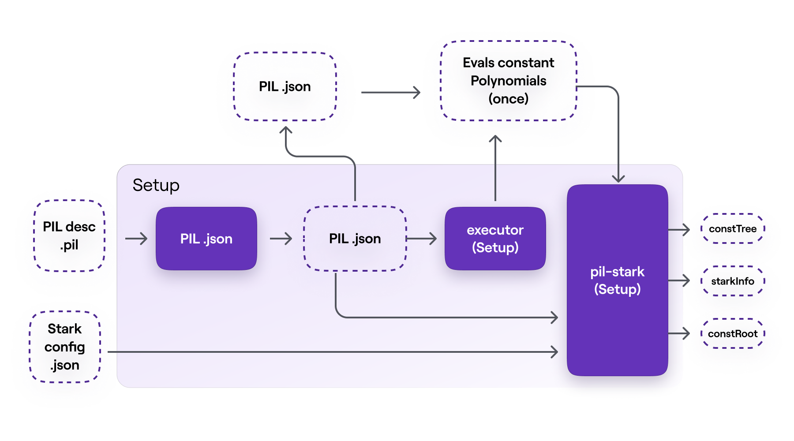
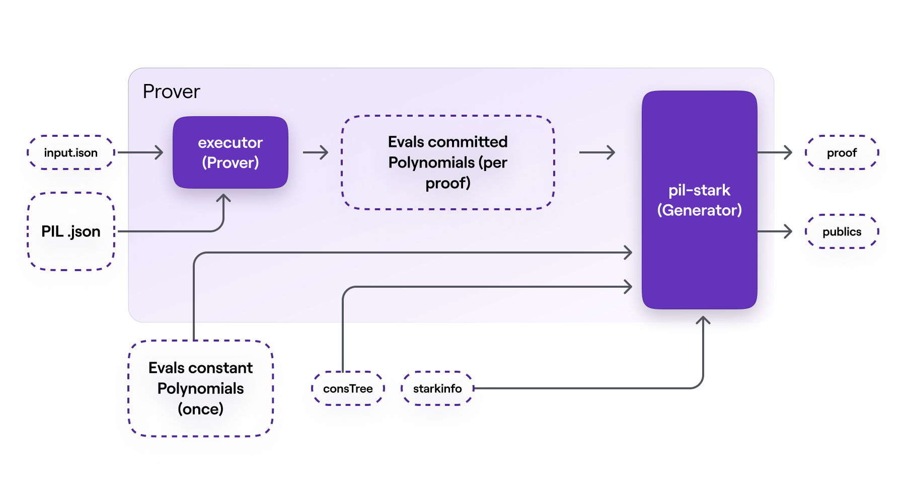
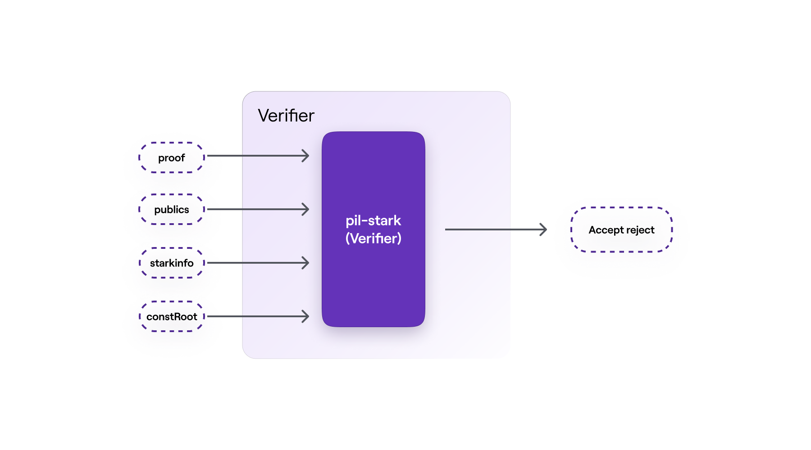

:::info

This document describes the three phases of the PIL-STARK proof/verification process viz. the Setup Phase, Proving Phase, and Verification Phase.

The description given here is by no means the architecture of the PIL-STARK system.

:::

Simply put, **PIL-STARK** is a special STARK that enables; 

- the State Machine Prover (SM-Prover) to generate a **STARK** proofs for a State Machine written in **PIL**
- And, the State Machine Verifier (SM-Verifier) to verify the STARK-proofs provided by the Prover. 

Hence there is a PIL-STARK component in the SM-Prover which is the **Generator** of a STARK proof, and another PIL-STARK component in the SM-Verifier which is the actual **Verifier** of the STARK proof.

Since the SM-Prover and the SM-Verifier, who are separate and independent entities, require certain PIL-STARK parameters prior to proving and verification, the system needs some preprocessing phase. Call this phase, the **Setup** Phase.

The PIL-STARK proof/verification process therefore consists of three (3) phases; the Setup, the Proving and the Verification. These are outlined below.

## PIL-STARK Setup Phase

The Setup Phase can be thought of as consisting of three 'components'; the $\texttt{PILCOM}$, the Setup $\texttt{Executor}$ and the $\texttt{PIL-STARK Setup}$.

### Compilation With PILCOM

The novel compiler, called $\texttt{PILCOM}$, which is used for compiling a $\texttt{.pil}$ file into a parsed $\texttt{.json}$ file, is part of the Setup Phase of PIL-STARK. The compilation of the $\texttt{.pil}$ file into a parsed $\texttt{.json}$ file therefore happens in this phase of the PIL-STARK proof/verification process.

### The Setup Executor

The $\texttt{Setup Executor}$ takes as input the PIL $\texttt{.json}$ file from $\texttt{PILCOM}$ in order to compute the evaluations of the state machine's constant polynomials. For each state machine, described by the $\texttt{.pil}$ file compiled with $\texttt{PILCOM}$, the execution process is carried out only once.

### PIL-STARK Setup

The PIL-STARK Setup takes as inputs; the PIL $\texttt{.json}$ file from $\texttt{PILCOM}$, the evaluations of the constant polynomials from the $\texttt{Setup}$ $\texttt{Executor}$, and the STARK configuration information in the form of a $\texttt{starkstruct.json}$ file. It then creates a Merkle tree with the evaluations of all the constant polynomials, called the $\texttt{constTree}$

It outputs PIL-STARK parameters; the $\texttt{constTree}$ which is a Merkle Tree of evaluations of the constant polynomials, the $\texttt{starkInfo}$ which is a STARK-specific information, and the $\texttt{constRoot}$ which is the root of the $\texttt{constTree}$.

Overall, the Setup Phase of PIL-STARK takes as inputs; the $\texttt{.pil}$ file describing the state machine and STARK-specific parameters. Its outputs are; the evaluations of the constant polynomials, the $\texttt{constTree}$, the $\texttt{starkInfo}$, the $\texttt{constRoot}$, as well as the PIL $\texttt{.json}$ file from $\texttt{PILCOM}$.

We emphasise that the Setup Phase of PIL-STARK is run only once for a particular $\texttt{.pil}$ file describing the state machine. A change in the $\texttt{.pil}$ file means a fresh Setup needs to be executed.

## PIL-STARK Proving Phase

The Proving Phase consists of two main components; the $\texttt{SM-Prover}$ $\texttt{Executor}$ and the PIL-STARK proof $\texttt{Generator}$.

### The SM-Prover's Executor

The executor in the SM-Prover's takes as inputs; the PIL $\texttt{.json}$ file from $\texttt{PILCOM}$ and another $\texttt{.json}$ file of inputs, called $\texttt{input.json}$ . In the case of our mFibonacci SM, the inputs in $\texttt{input.json}$ includes the initial values of the registries $\texttt{A}$ and $\texttt{B}$.

The SM-Prover's Executor builds the values of polynomials that are to be committed. Its output is the evaluations of the committed polynomials, per proof. These evaluations of committed polynomials are actually the SM's execution trace.

Note that the input values in the $\texttt{input.json}$ file can be varied without altering the actual state machine. The reason the state machine remains intact is due to fact that the $\texttt{.pil}$ file, that was initially compiled in the Setup phase, is not affected by any change in the input values of the SM-Prover's Executor.

However, with every set of inputs, the SM-Prover's Executor computes corresponding evaluations of the committed polynomials to be used in generating the respective STARK proof. In other words, each new set of inputs determines a new set of evaluations, which in turn determines the STARK proof generated by the PIL-STARK Generator.

### PIL-STARK Proof Generator

This STARK Proof Generator takes as inputs; the evaluations of the committed polynomials from the SM-Prover's Executor, the evaluations of the constant polynomials from the Setup Phase, together with the $\texttt{constTree}$ and the $\texttt{starkInfo}$.

This is where the evaluations of the committed polynomials, from the SM-Prover's Executor, are Merkelized. And all elements of the ultimate STARK proof are generated, these include; the witness and the required openings of the committed polynomials. 

The output of the STARK Proof Generator is a $\texttt{STARK}$ $\texttt{proof}$ and the $\texttt{publics}$, which are values to be publicised.

For the PIL-STARK Proving Phase as a whole, also as depicted in Figure 9 below, 

- there are five (5) inputs; the $\texttt{input.json}$ file, the PIL $\texttt{.json}$ file from $\texttt{PILCOM}$, the evaluations of the constant polynomials from the Setup Phase, as well as the $\texttt{constTree}$ and the $\texttt{starkInfo}$.
- and there are two (2) outputs; a $\texttt{STARK}$ $\texttt{proof}$ and the $\texttt{publics}$.

## PIL-STARK Verification Phase

The Verification Phase is constituted by the PIL-STARK Verifier. 

As it is common practice amongst zero-knowledge proof/verification systems, the size of the Verifier's inputs is very small compared to that of the Prover's inputs. For example, while the Proving Phase takes the whole $\texttt{constTree}$ as one of its inputs, the Verifier takes the $\texttt{constRoot}$ instead.

The inputs to the Verifier are; the $\texttt{STARK}$ $\texttt{proof}$ and the $\texttt{publics}$ from the Prover, together with the $\texttt{starkInfo}$ and the $\texttt{constRoot}$ from the Setup Phase.

And the Verifier's output is either an $\texttt{Accept}$ if the proof is accepted, or a $\texttt{Reject}$ if the proof is rejected.

PIL-STARK is, all-in-all, a specific implementation of a STARK that can be used as a generic tool for proving state machines' polynomial identities.

The actual implementation of PIL-STARK uses recursion. That is, hundreds of STARK proofs are proved with another STARK proof, and these STARK proofs of other STARK proofs are also proved with a single STARK proof. This achieves exponential scalability than it would otherwise be possible.

The code for implementing PIL-STARK is found in the zkEVM repository [here](https://github.com/0xPolygonHermez/pil-stark).
